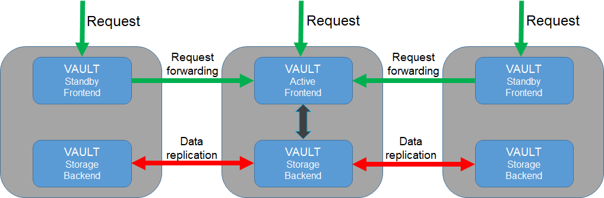

Service design and implementation
=================================

In this section, the design and implementation of the service will be explained. It may be interesting
for advanced users and developers how to achieve high availability of the service via Dynamic DNS.

Vault servers
*************

Three Vault servers located at IISAS, INFN and  IFCA for high availability with server names:

* vault-iisas.services.fedcloud.eu,
* vault-infn.services.fedcloud.eu,
* vault-ifca.services.fedcloud.eu.

The servers are connected together to a cluster (one active, two standby). If the active server falls,
one of the remaining standby servers will become active automatically. Data is replicated among servers
using the Raft Consensus algorithm supported by Vault integrated storage.

Users can connect directly to any of the mentioned servers. If the connected server is in standby mode,
it will forward users’ requests to the active server.

Generic endpoint and high availability
**************************************

As mentioned above, users can use any of the endpoints directly:

* https://vault-iisas.services.fedcloud.eu:8200,
* https://vault-infn.services.fedcloud.eu:8200,
* https://vault-ifca.services.fedcloud.eu:8200,

However, accessing the service via the endpoints is not recommended: if a server is down, its endpoint
is not accessible.

For convenience and high availability, a generic endpoint https://vault.services.fedcloud.eu:8200
should be used for accessing the service. The endpoint will be attached to one of the *vault-infn*
and *vault-ifca* server instances automatically via Dynamic DNS service (located at IISAS).
A simple cron script, running on the server instances at INFN and IFCA, will make a periodically
check and assign the generic hostname *vault.services.fedcloud.eu* to the healthy server.

The recovery time of the generic endpoint, in the case of the unscheduled downtime of the generic
endpoint’s server, is T+1 minutes, where T is the interval between cron checks (1min) . In the case
of scheduled downtime for maintenance, admins simply assign the generic endpoint to the other server
instance before shutdowning the service.
